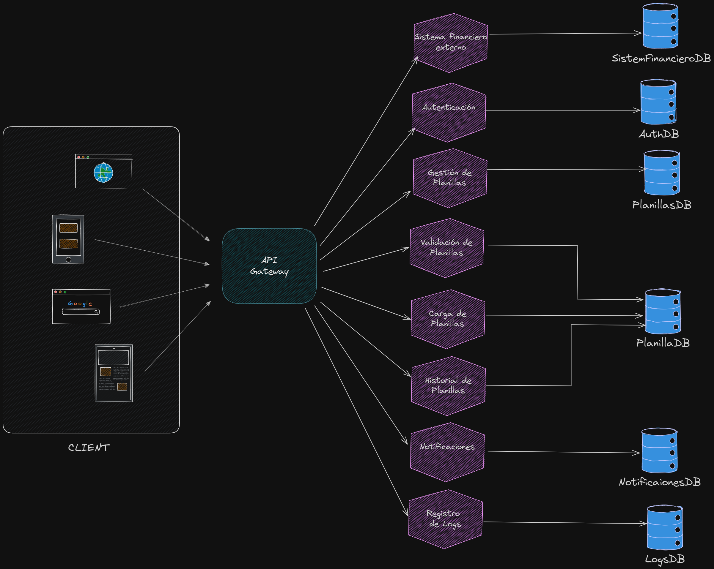

# Sistema de Planillas Basado en Microservicios (Practica 3)

| Nombre                       | Carnet    |
| ---------------------------- | --------- |
| Angel Francisco Sique Santos | 202012039 |

# Índice

1. [Diagrama de Arquitectura](#diagrama-de-arquitectura)
2. [Descripción y Funcionalidad de Cada Microservicio](#descripción-y-funcionalidad-de-cada-microservicio)
    1. [Sistema Financiero Externo](#1-sistema-financiero-externo)
    2. [Autenticación](#2-autenticación)
    3. [Gestión de Planillas](#3-gestión-de-planillas)
    4. [Validación de Planillas](#4-validación-de-planillas)
    5. [Carga de Planillas](#5-carga-de-planillas)
    6. [Historial de Planillas](#6-historial-de-planillas)
    7. [Notificaciones](#7-notificaciones)
    8. [Registro de Logs](#8-registro-de-logs)
    9. [API Gateway](#9-api-gateway)
3. [Estructura de Bases de Datos para Microservicios de Planillas](#estructura-de-bases-de-datos-para-microservicios-de-planillas)
    1. [Sistema Financiero Externo (SistemaFinancieroDB)](#sistema-financiero-externo-sistemafinancierodb)
    2. [Autenticación (AuthDB)](#autenticación-authdb)
    3. [Gestión de Planillas (PlanillasDB)](#gestión-de-planillas-planillasdb)
    4. [Validación y Carga de Planillas (PlanillaDB)](#validación-y-carga-de-planillas-planilladb)
    5. [Historial de Planillas (HistorialPlanillasDB)](#historial-de-planillas-historialplanillasdb)
    6. [Notificaciones (NotificacionesDB)](#notificaciones-notificacionesdb)
    7. [Registro de Logs (LogsDB)](#registro-de-logs-logsdb)
4. [Descripción de la Solución](#descripción-de-la-solución)
    1. [Componentes Principales](#componentes-principales)
    2. [Funcionamiento General](#funcionamiento-general)
    3. [Ventajas de la Arquitectura](#ventajas-de-la-arquitectura)


# Diagrama de Arquitectura

[](./images/arquitectura.png)

# Descripción y Funcionalidad de Cada Microservicio


## 1. Sistema Financiero Externo  
Este servicio representa un sistema externo que recibe las planillas aprobadas.

---

## 2. Autenticación  
Gestiona la autenticación y autorización de usuarios utilizando el servicio OAuth existente, complementando con roles y permisos internos.

---

## 3. Gestión de Planillas  
Encargado de gestionar las planillas desde su creación hasta su aprobación final. Administra los datos de empleados y el flujo de aprobación, interactuando con otros servicios como autenticación, notificaciones y el sistema financiero externo.

---

## 4. Validación de Planillas  
Realiza validaciones sobre los datos de las planillas cargadas, asegurando que cumplan con las reglas de negocio. Envía los datos validados al servicio de "Gestión de Planillas".

---

## 5. Carga de Planillas  
Permite a los usuarios cargar archivos CSV con información de las planillas, procesando y almacenando estos archivos para su validación y gestión posterior.

---

## 6. Historial de Planillas  
Mantiene un registro detallado de todas las planillas procesadas, permitiendo consultar datos históricos y estados previos de las planillas.

---

## 7. Notificaciones  
Envía notificaciones a los empleados cuando sus planillas son aprobadas, utilizando servicios de correo electrónico o mensajería integrados.

---

## 8. Registro de Logs  
Centraliza los registros de actividades del sistema para auditoría y seguridad, permitiendo el análisis y monitoreo de acciones críticas en todos los microservicios.

---

## 9. API Gateway  
Es el punto de entrada del sistema, encargado de autenticar, autorizar y enrutar las solicitudes a los microservicios adecuados, proporcionando una capa adicional de seguridad y control.

# Estructura de Bases de Datos para Microservicios de Planillas

## Sistema Financiero Externo (SistemaFinancieroDB)
La base de datos almacena la información de los pagos procesados por el sistema financiero externo.
```sql
CREATE DATABASE SistemaFinancieroDB;
USE SistemaFinancieroDB;
CREATE TABLE Pagos (
    id INT AUTO_INCREMENT PRIMARY KEY,
    planilla_id INT NOT NULL,
    estado VARCHAR(50),
    fecha_proceso DATETIME,
    monto_total DECIMAL(10,2)
);
```


## Autenticación (AuthDB)
Almacena usuarios, contraseñas y permisos para el sistema de autenticación.
```sql
CREATE DATABASE AuthDB;
USE AuthDB;
CREATE TABLE Usuarios (
    id INT AUTO_INCREMENT PRIMARY KEY,
    username VARCHAR(50) NOT NULL UNIQUE,
    password_hash VARCHAR(255) NOT NULL,
    rol VARCHAR(50),
    permisos JSON,
    ultimo_acceso DATETIME
);
```


## Gestión de Planillas (PlanillasDB)
Guarda las planillas, su estado y la información relacionada con el proceso de aprobación.
```sql
CREATE DATABASE PlanillasDB;
USE PlanillasDB;
CREATE TABLE Planillas (
    id INT AUTO_INCREMENT PRIMARY KEY,
    nombre VARCHAR(255),
    estado VARCHAR(50),
    fecha_creacion DATETIME,
    fecha_aprobacion DATETIME
);
```


## Validación y Carga de Planillas (PlanillaDB)
Mantiene un registro de los archivos CSV cargados y su estado de validación.
```sql
CREATE DATABASE PlanillaDB;
USE PlanillaDB;
CREATE TABLE ArchivosPlanilla (
    id INT AUTO_INCREMENT PRIMARY KEY,
    nombre_archivo VARCHAR(255),
    ruta_archivo VARCHAR(255),
    estado_validacion VARCHAR(50),
    fecha_carga DATETIME
);
```

## Historial de Planillas (HistorialPlanillasDB)
Guarda el historial de cambios de estado de las planillas.
```sql
CREATE DATABASE HistorialPlanillasDB;
USE HistorialPlanillasDB;
CREATE TABLE Historial (
    id INT AUTO_INCREMENT PRIMARY KEY,
    planilla_id INT NOT NULL,
    estado_anterior VARCHAR(50),
    estado_nuevo VARCHAR(50),
    fecha DATETIME
);
```


## Notificaciones (NotificacionesDB)
Registra las notificaciones enviadas a los empleados.
```sql
CREATE DATABASE NotificacionesDB;
USE NotificacionesDB;
CREATE TABLE Notificaciones (
    id INT AUTO_INCREMENT PRIMARY KEY,
    planilla_id INT NOT NULL,
    usuario_id INT NOT NULL,
    tipo VARCHAR(50),
    mensaje TEXT,
    fecha_envio DATETIME
);
```


## Registro de Logs (LogsDB)
Almacena logs del sistema para auditoría y monitoreo.
```sql
CREATE DATABASE LogsDB;
USE LogsDB;
CREATE TABLE Logs (
    id INT AUTO_INCREMENT PRIMARY KEY,
    servicio VARCHAR(100),
    nivel VARCHAR(50),
    mensaje TEXT,
    fecha DATETIME
);
```


# Descripción de la Solución

La arquitectura está basada en microservicios, donde cada microservicio se encarga de una función específica dentro del proceso de gestión de planillas. Todos los microservicios están detrás de un API Gateway, que actúa como punto de entrada único para los clientes (usuarios que acceden al sistema). Cada microservicio tiene su propia base de datos, lo que permite una mayor independencia y escalabilidad.

### Componentes Principales:

1.  **Cliente:** Representa a los usuarios que interactúan con el sistema a través de diferentes dispositivos (navegador web, aplicaciones móviles, etc.).

2.  **API Gateway:** Actúa como punto de entrada único para todas las solicitudes de los clientes. Se encarga de la autenticación, autorización y enrutamiento de las solicitudes a los microservicios correspondientes.

3.  **Microservicios:**
    *   **Sistema Financiero Externo:** Interactúa con un sistema externo para el procesamiento de pagos e informes financieros. Tiene su propia base de datos (`SistemFinancieroDB`).
    *   **Autenticación:** Gestiona la autenticación y autorización de los usuarios. Utiliza la base de datos `AuthDB`.
    *   **Gestión de Planillas:** Es el núcleo del sistema, encargado de gestionar las planillas, su estado y el flujo de aprobación. Utiliza la base de datos `PlanillasDB`.
    *   **Validación de Planillas:** Valida los datos de las planillas antes de ser procesadas. Utiliza la base de datos `PlanillaDB`.
    *   **Carga de Planillas:** Permite la carga de archivos CSV con la información de las planillas. Utiliza la base de datos `PlanillaDB`.
    *   **Historial de Planillas:** Almacena un registro de todas las planillas procesadas. Utiliza la base de datos `Historial de PlanillasDB`.
    *   **Notificaciones:** Envía notificaciones a los empleados. Utiliza la base de datos `NotificacionesDB`.
    *   **Registro de Logs:** Registra todas las actividades del sistema para auditoría y seguridad. Utiliza la base de datos `LogsDB`.

### Bases de Datos:

Cada microservicio tiene su propia base de datos, lo que permite una mayor independencia y escalabilidad.

### Funcionamiento General:

1.  El cliente envía una solicitud al API Gateway.
2.  El API Gateway autentica y autoriza la solicitud.
3.  El API Gateway enruta la solicitud al microservicio correspondiente.
4.  El microservicio procesa la solicitud y accede a su propia base de datos.
5.  El microservicio devuelve una respuesta al API Gateway.
6.  El API Gateway devuelve la respuesta al cliente.

### Ventajas de la Arquitectura:

*   **Escalabilidad:** Cada microservicio puede ser escalado de forma independiente.
*   **Independencia:** Los microservicios pueden ser desarrollados, desplegados y actualizados de forma independiente.
*   **Resiliencia:** Si un microservicio falla, los demás microservicios siguen funcionando.
*   **Flexibilidad Tecnológica:** Se pueden utilizar diferentes tecnologías para cada microservicio.
