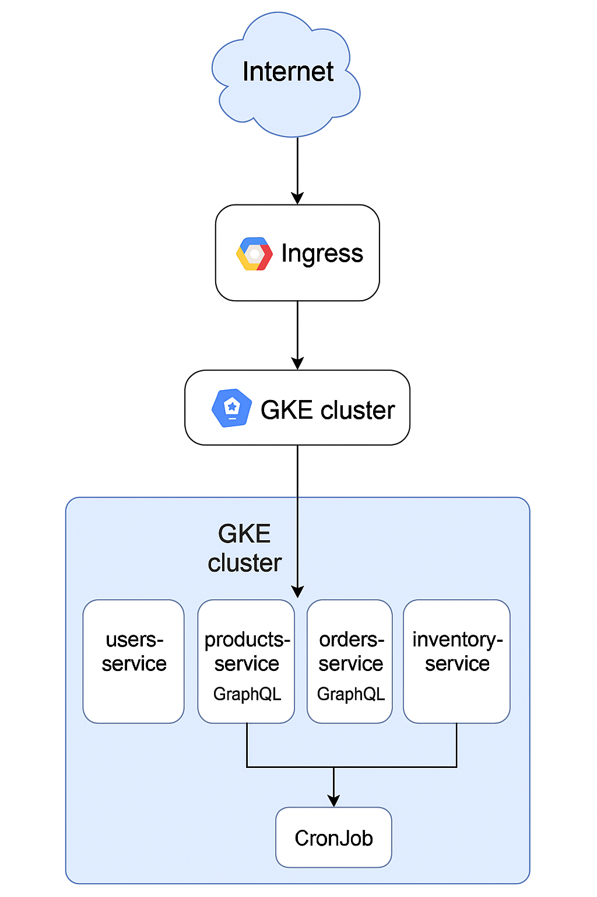

# 🚀 Práctica 6 - Despliegue en la nube con GKE

## 🎯 Objetivo

Desplegar en un entorno real de nube (Google Kubernetes Engine - GKE) la arquitectura de microservicios desarrollada en prácticas anteriores. Utilizar servicios externos como Ingress, cronjob, escalamiento automático (HPA) y almacenamiento en contenedores (Docker Hub), y documentar todo el proceso de implementación.

---

## 🌐 Plataforma de nube seleccionada: **Google Cloud Platform (GCP)**

**Justificación:**

- GCP proporciona integración directa con Kubernetes mediante Google Kubernetes Engine (GKE)
- Soporte nativo para `Ingress`, `HPA`, `CronJob`, volúmenes y balanceo de carga
- Créditos académicos y documentación clara
- Interfaz gráfica amigable para seguimiento del clúster

---

## 🧱 Arquitectura del sistema

- 4 microservicios (users, products, orders, inventory)
- Desplegados como `Deployment` con `Service` tipo ClusterIP
- Autoescalamiento con HPA (Horizontal Pod Autoscaler)
- Acceso externo mediante `Ingress` GCE
- `CronJob` funcional ejecutándose cada 2 minutos

```
Cliente ⇄ Ingress GCE ⇄ Servicios (Users, Products, Orders, Inventory)
                          ⇩
                      CronJob (registro)
```

---

## ☁️ Configuración del clúster

- **Nombre:** `sa-p5`
- **Tipo:** Clúster estándar
- **Zona:** `us-central1-c`
- **Nodos:** 3
- **Modo:** Kubernetes Engine (GKE)

---

## 📁 Estructura del proyecto

```
P6/
├── docs/
│   └── README.md
├── kubernetes/
│   ├── namespace.yaml
│   ├── deployments/
│   ├── hpa/
│   ├── services/
│   ├── ingress/
│   │   └── ingress.yaml
│   └── cronjob/
│       ├── cronjob.yaml
│       └── script.py
```

---

## 📦 Arquitectura



## 🔧 Comandos utilizados

### GCP & conexión

```bash
gcloud container clusters get-credentials sa-p5 --zone us-central1-c
```

### Kubernetes

```bash
kubectl apply -f namespace.yaml
kubectl apply -f deployments/ --recursive
kubectl apply -f hpa/ --recursive
kubectl apply -f services/ --recursive
kubectl apply -f cronjob/cronjob.yaml
kubectl apply -f ingress/ingress.yaml
```

### Verificación

```bash
kubectl get all -n sa-p5
kubectl get ingress -n sa-p5
kubectl get cronjob -n sa-p5
kubectl logs job/<job-name> -n sa-p5
```

---

## 🧪 Pruebas con Postman

### REST

- `GET` http://<IP_PUBLICA>/users/
- `POST` http://<IP_PUBLICA>/users/ con JSON body

### GraphQL

- `POST` http://<IP_PUBLICA>/products/graphql
```json
{
  "query": "{ products { id name price } }"
}
```

---

## 🧠 Resultado final

- Microservicios desplegados correctamente en la nube
- Ingress funcional con IP pública asignada
- CronJob ejecutándose automáticamente cada 2 minutos
- Arquitectura escalable y accesible externamente

---

## ✅ Conclusión

Se logró desplegar un entorno real de microservicios en la nube utilizando Kubernetes, GKE, Docker y servicios como Ingress y CronJob. Esto refuerza los conocimientos de DevOps, arquitectura distribuida y despliegue de contenedores en producción.

