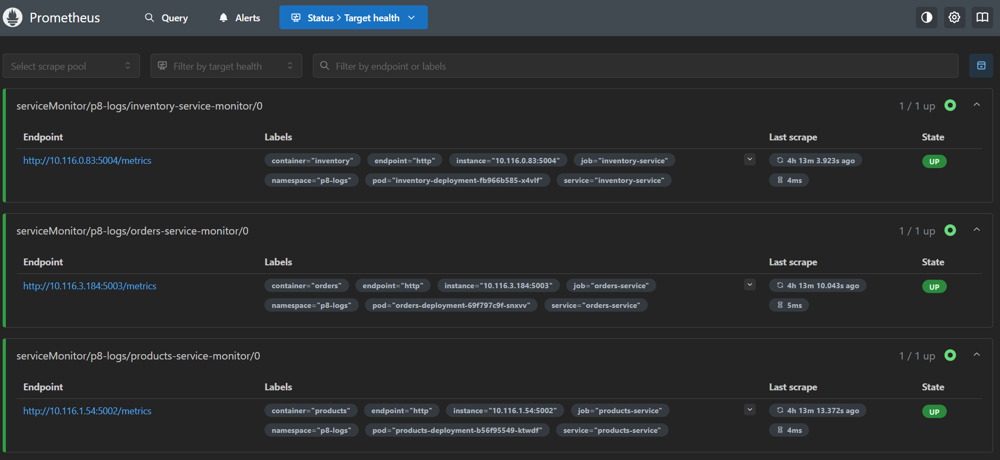
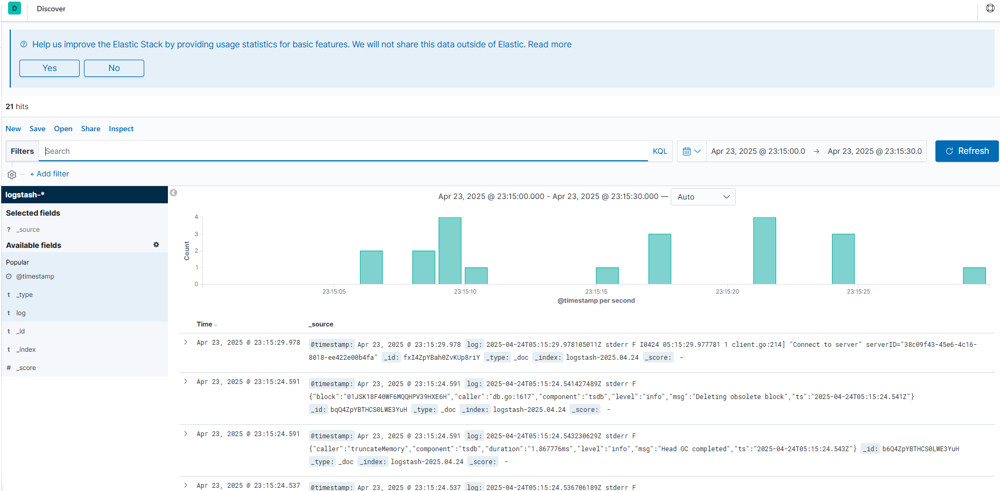
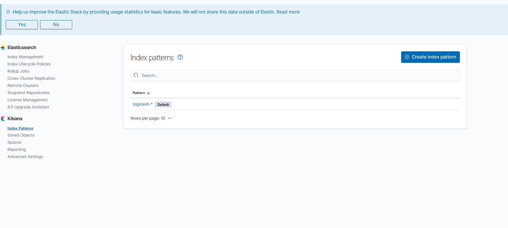
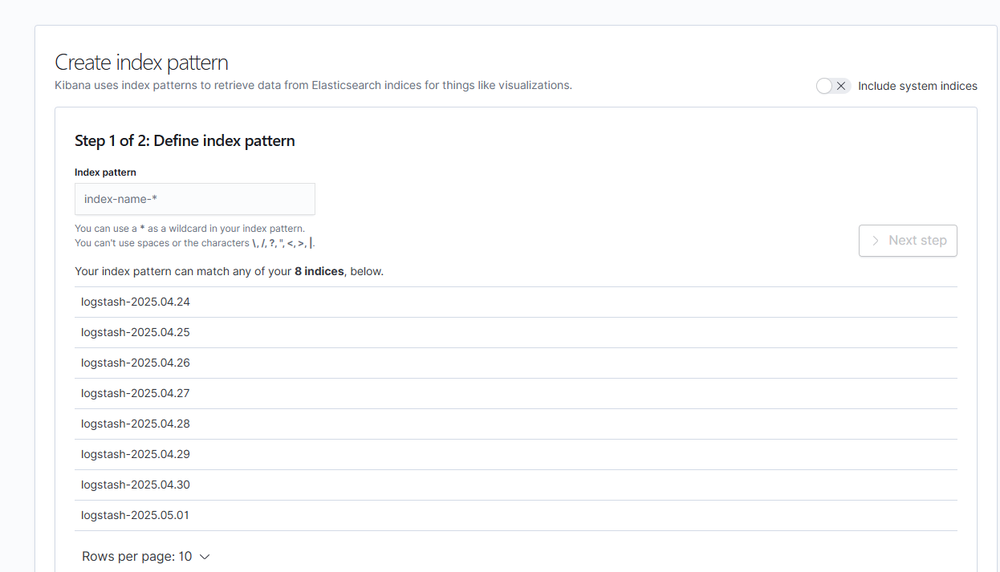
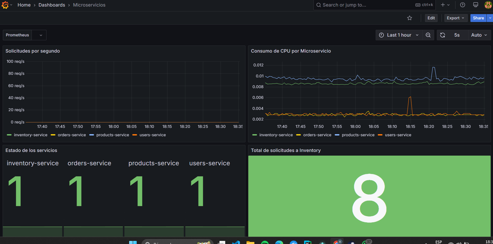
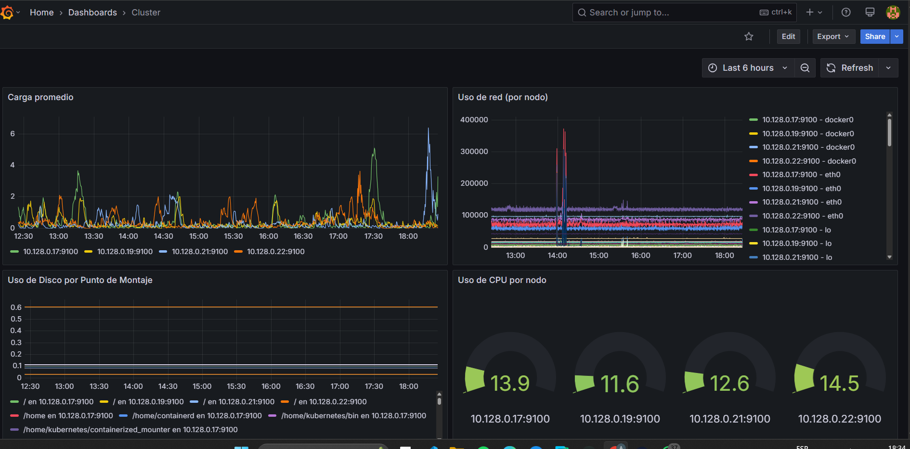
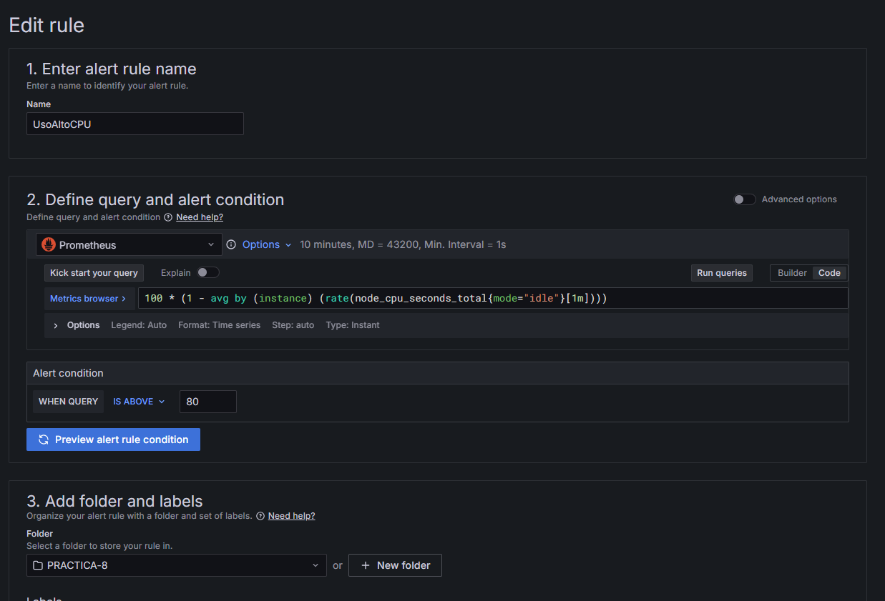

# Practica 8: Logs y Monitoreo

Angel Sique - 202012039

---

# Índice de la Documentación

1. [Configuración de Prometheus y Grafana](#1-configuración-de-prometheus-y-grafana)  
   1.1 [Instalación con Helm](#11-instalación-con-helm-opcional-si-no-se-usó-helm)  
   1.2 [Acceso a Grafana y Prometheus](#12-acceso-a-grafana-y-prometheus)  
   1.3 [Configuración de ServiceMonitor y puertos](#13-crear-el-servicemonitor-y-exponer-puertos-en-cada-microservicio)

2. [Configuración de métricas personalizadas (Prometheus Client)](#2-configuración-de-métricas-personalizadas-prometheus-client)

   2.1 [En Flask (Python)](#21-en-flask-python)  
   2.2 [En Express (Node.js)](#22-en-express-nodejs)

3. [Configuración de Fluent Bit, Elasticsearch y Kibana](#3-configuración-de-fluent-bit-elasticsearch-y-kibana)  
   3.1 [Fluent Bit como DaemonSet](#31-fluent-bit-como-daemonset)  
   3.2 [Despliegue de Elasticsearch](#32-elasticsearch)  
   3.3 [Despliegue de Kibana](#33-kibana)  
   3.4 [Ingreso a Kibana](#34-ingreso-a-kibana)

4. [Dashboards en Grafana](#4-dashboards-en-grafana)  
   4.1 [Dashboard de Microservicios](#dashboard-de-grafana---microservicios)  
   4.2 [Dashboard del Clúster](#dashboard-cluster)

5. [Configuración de alertas](#5-configuración-de-alertas)  
   5.1 [Crear alerta en Grafana](#51-crear-alerta-en-grafana)

6. [Actualización de servicios y pods](#6-actualización-de-servicios-y-pods)  
   6.1 [Build y Push de imagen Docker](#61-build-y-push-de-imagen-docker)  
   6.2 [Rollout del Deployment](#62-rollout-del-deployment)  
   6.3 [Eliminar pods antiguos](#63-eliminar-pods-antiguos)

7. [Observaciones](#7-observaciones)

---

## 1. Configuración de Prometheus y Grafana

### 1.1 Instalación con Helm
```bash
helm repo add prometheus-community https://prometheus-community.github.io/helm-charts
helm repo update
helm install prometheus-stack prometheus-community/kube-prometheus-stack -n p8-logs --create-namespace
```


### 1.2 Acceso a Grafana y Prometheus
- **Grafana**: `http://<EXTERNAL_IP>:3000`
- **Prometheus**: `http://<EXTERNAL_IP>:9090`

- **Credenciales Grafana**:
  - Usuario: `admin`
  - Contraseña: `prom-operator`

### 1.3 Crear el `ServiceMonitor` y exponer puertos en cada microservicio:
Ejemplo para el microservicio de inventario:
```yaml
apiVersion: v1
kind: Service
metadata:
  name: inventory-service
  namespace: p8-logs
  labels:
    app: inventory
spec:
  type: ClusterIP
  selector:
    app: inventory
  ports:
    - port: 5004
      targetPort: 5004
      protocol: TCP
```

---

## 2. Configuración de métricas personalizadas (Prometheus Client)

Prometheus permite recolectar métricas que los microservicios exponen en un endpoint específico. A continuación, se muestran ejemplos para servicios implementados en **Flask (Python)** y **Express (Node.js)**.

---

### 2.1 En Flask (Python)

#### Instalación

```bash
pip install prometheus_client
```

#### Ejemplo básico

```python
from flask import Flask, request, Response
from prometheus_client import Counter, Histogram, generate_latest, CONTENT_TYPE_LATEST
import time

app = Flask(__name__)

# Métricas
requests_total = Counter('users_http_requests_total', 'Total de solicitudes')
errors_total = Counter('users_http_errors_total', 'Errores HTTP')
response_time = Histogram('users_response_time_seconds', 'Tiempo de respuesta')

@app.before_request
def before_request():
    request.start_time = time.time()
    requests_total.inc()

@app.after_request
def after_request(response):
    duration = time.time() - request.start_time
    response_time.observe(duration)
    if response.status_code >= 400:
        errors_total.inc()
    return response

@app.route("/metrics")
def metrics():
    return Response(generate_latest(), mimetype=CONTENT_TYPE_LATEST)
```

Este código mide cuántas solicitudes se han recibido, cuántos errores han ocurrido y cuánto tarda cada respuesta.

---

### 2.2 En Express (Node.js)

#### Instalación

```bash
npm install express prom-client
```

#### Ejemplo básico

```javascript
const express = require('express');
const client = require('prom-client');
const app = express();
const register = new client.Registry();

// Métricas
const requestsTotal = new client.Counter({
  name: 'users_http_requests_total',
  help: 'Total de solicitudes'
});

const errorsTotal = new client.Counter({
  name: 'users_http_errors_total',
  help: 'Errores HTTP'
});

const responseTime = new client.Histogram({
  name: 'users_response_time_seconds',
  help: 'Tiempo de respuesta en segundos',
  buckets: [0.1, 0.5, 1, 2, 5]
});

// Registrar métricas
register.registerMetric(requestsTotal);
register.registerMetric(errorsTotal);
register.registerMetric(responseTime);
client.collectDefaultMetrics({ register });

app.use((req, res, next) => {
  const end = responseTime.startTimer();
  requestsTotal.inc();

  res.on('finish', () => {
    end(); // Observa duración
    if (res.statusCode >= 400) {
      errorsTotal.inc();
    }
  });

  next();
});

app.get('/metrics', async (req, res) => {
  res.set('Content-Type', register.contentType);
  res.end(await register.metrics());
});

app.listen(5000, () => {
  console.log('Servidor escuchando en puerto 5000');
});
```

Este código en Node.js hace lo mismo que el de Flask: mide solicitudes totales, errores y tiempo de respuesta por medio de Prometheus.

---

## 3. Configuración de Fluent Bit, Elasticsearch y Kibana

Para implementar un sistema de **observabilidad de logs** en Kubernetes, se utilizó la arquitectura **EFK (Elasticsearch, Fluent Bit, Kibana)**. A continuación se describe cada componente, su rol, y la configuración empleada.

---

### 3.1 Fluent Bit como DaemonSet

**Fluent Bit** es un *log forwarder* ligero y eficiente que recolecta los logs de los contenedores desde el nodo donde corre, los filtra y los envía a Elasticsearch.

#### Objetivo
Recolectar logs de todos los contenedores en el clúster desde la ruta:
```
/var/log/containers/*.log
```

#### Despliegue

- Se usa un `ConfigMap` para definir la configuración global, entrada, filtros y salida de logs.
- Se implementa como `DaemonSet` para que haya un pod corriendo en cada nodo del clúster.

#### Fragmento de ConfigMap:

```ini
[SERVICE]
    Flush        1
    Log_Level    info
    Parsers_File parsers.conf
    HTTP_Server  On
    HTTP_Port    2020

[INPUT]
    Name        tail
    Path        /var/log/containers/*.log
    Parser      docker
    Tag         kube.*

[FILTER]
    Name        kubernetes
    Match       kube.*
    Merge_Log   On
    Keep_Log    On

[OUTPUT]
    Name        es
    Match       *
    Host        elasticsearch.p8-logs.svc.cluster.local
    Port        9200
    Index       kubernetes-logs
```

#### Nota importante:
También se incluye un `parser` para leer logs en formato JSON, como es común con Docker y Kubernetes.

---

### 3.2 Elasticsearch

**Elasticsearch** es una base de datos de búsqueda y análisis altamente escalable, utilizada para almacenar y consultar logs indexados.

#### Despliegue como StatefulSet

- 3 réplicas para alta disponibilidad.
- Volúmenes persistentes con `volumeClaimTemplates`.
- Inicialización del contenedor con scripts que ajustan:
  - Permisos.
  - `vm.max_map_count`.
  - Límites de `ulimit`.

```yaml
apiVersion: apps/v1
kind: StatefulSet
metadata:
  name: es-cluster
spec:
  replicas: 3
  ...
  initContainers:
    - name: increase-vm-max-map
      command: ["sysctl", "-w", "vm.max_map_count=262144"]
```

> Esto es necesario para que Elasticsearch pueda ejecutarse sin errores relacionados con mapeo de memoria o límites de archivo.

---

### 3.3 Kibana

**Kibana** permite visualizar e interactuar con los datos de Elasticsearch mediante dashboards gráficos y búsquedas.



#### Despliegue

- Se utiliza una imagen oficial de Kibana (`docker.elastic.co/kibana/kibana:7.2.0`).
- Expone el puerto `5601`.
- La variable de entorno `ELASTICSEARCH_URL` apunta al servicio de Elasticsearch.

```yaml
env:
  - name: ELASTICSEARCH_URL
    value: http://elasticsearch:9200
```

#### Servicio
Se crea un `Service` tipo `NodePort` para exponer Kibana fuera del clúster si se desea acceder desde el navegador.

---

### 3.4 Acceso a Kibana y creación de índice

Para acceder a Kibana:

```bash
kubectl port-forward svc/kibana 5601:5601 -n p8-logs
```

Luego ingresar desde el navegador a:  
```
http://localhost:5601
```

#### Configuración del índice

- Navegar a **"Management" > "Index Patterns"**
- Crear el índice:
  ```
  kubernetes-logs-*
  ```





Esto permitirá explorar los logs recolectados por Fluent Bit e indexados por Elasticsearch.

---

## 4. Dashboards en Grafana

## Dashboard de Grafana - Microservicios

Este dashboard permite monitorear de forma gráfica el estado y rendimiento de los microservicios desplegados en el clúster.



### Paneles incluidos:

1. **Solicitudes por segundo**
   - **Métrica**: `rate(users_http_requests_total[1m])`, `rate(graphql_requests_total[1m])`, `rate(inventory_http_requests_total[1m])`
   - **Visualización**: Time series
   - **Descripción**: Muestra el número de solicitudes por segundo para cada microservicio.

2. **Consumo de CPU por Microservicio**
   - **Métrica**: `rate(process_cpu_seconds_total{job=~"users-service|products-service|orders-service|inventory-service"}[1m])`
   - **Visualización**: Time series
   - **Descripción**: Permite observar cuánta CPU consume cada microservicio.

3. **Estado de los servicios**
   - **Métrica**: `up{job=~"users-service|products-service|orders-service|inventory-service"}`
   - **Visualización**: Stat
   - **Descripción**: Indica si los servicios están activos (1) o caídos (0).

4. **Total de solicitudes a Inventory**
   - **Métrica**: `inventory_http_requests_total`
   - **Visualización**: Stat

5. **Errores por segundo**
   - **Métrica**: `rate(users_http_errors_total[1m])`
   - **Visualización**: Time series
   - **Descripción**: Visualiza cuántos errores se generan por segundo.

6. **Total de solicitudes a Users**
   - **Métrica**: `users_http_requests_total`
   - **Visualización**: Stat

7. **Memoria RAM usada por Servicio**
   - **Métrica**: `process_resident_memory_bytes{job=~"users-service|products-service|orders-service|inventory-service"} / (1024 * 1024)`
   - **Visualización**: Time series
   - **Unidad**: MiB

8. **Total de solicitudes a GraphQL**
   - **Métrica**: `graphql_requests_total`
   - **Visualización**: Stat

9. **Solicitudes por segundo GraphQL**
   - **Métrica**: `rate(graphql_requests_total[1m])`
   - **Visualización**: Bar gauge

10. **Latencia Promedio Products**
    - **Métrica**: `rate(graphql_response_time_seconds_sum[1m]) / rate(graphql_response_time_seconds_count[1m])`
    - **Visualización**: Gauge

- **Datasource**: Prometheus


Este dashboard permite una visualización clara del desempeño de cada servicio, con métricas de disponibilidad, rendimiento y estabilidad.
## Dashboard: Cluster

Este dashboard fue diseñado para monitorear el estado general del clúster de Kubernetes, recopilando métricas clave desde Prometheus a través de node-exporter y kube-state-metrics. A continuación se describen los paneles y sus objetivos:



### 1. **Carga promedio (node_load1)**
- **Tipo**: Time Series
- **Métrica**: `node_load1`
- **Descripción**: Muestra la carga promedio del sistema por nodo. Es útil para detectar saturaciones de CPU a nivel de sistema operativo.

### 2. **Uso de red (por nodo)**
- **Tipo**: Time Series
- **Métrica**: `rate(node_network_receive_bytes_total[1m]) + rate(node_network_transmit_bytes_total[1m])`
- **Descripción**: Mide el tráfico de red entrante y saliente por dispositivo de red en cada nodo.

### 3. **Uso de disco por punto de montaje**
- **Tipo**: Time Series
- **Métrica**: `1 - (node_filesystem_avail_bytes{fstype!~"tmpfs|overlay"} / node_filesystem_size_bytes{fstype!~"tmpfs|overlay"})`
- **Descripción**: Proporciona el porcentaje de uso del sistema de archivos excluyendo sistemas temporales.

### 4. **Uso de CPU por nodo**
- **Tipo**: Gauge
- **Métrica**: `100 * (1 - avg by (instance) (rate(node_cpu_seconds_total{mode="idle"}[1m])))`
- **Descripción**: Muestra el porcentaje de CPU utilizada por cada nodo.

### 5. **Número de pods por estado**
- **Tipo**: Pie Chart
- **Métrica**: `count by (phase) (kube_pod_status_phase)`
- **Descripción**: Distribución de pods según su estado (`Running`, `Pending`, `Failed`, etc.).

### 6. **Reinicios de pods por namespace**
- **Tipo**: Time Series
- **Métrica**: `sum by (namespace) (rate(kube_pod_container_status_restarts_total[5m]))`
- **Descripción**: Mide la frecuencia de reinicios de contenedores agrupados por namespace, útil para detectar fallos recurrentes.

### 7. **Uso de memoria por nodo**
- **Tipo**: Time Series
- **Métrica**: `100 * (1 - (node_memory_MemAvailable_bytes / node_memory_MemTotal_bytes))`
- **Descripción**: Porcentaje de uso de memoria RAM por nodo.

### 8. **Pods pendientes o con fallo**
- **Tipo**: Stat
- **Métrica**: `sum(kube_pod_status_phase{phase=~"Pending|Failed"})`
- **Descripción**: Muestra el número total de pods que están en estado pendiente o fallido.

---

**Datasource**: Prometheus (`uid: prometheus`)

Este dashboard complementa al de microservicios, proporcionando una visión global del clúster y permitiendo detectar cuellos de botella o problemas sistémicos.

---

## 5. Configuración de alertas

### 5.1 Crear alerta en Grafana
1. En el panel -> "Edit"
2. Tab "Alert"
3. "Create Alert Rule"
4. Query:
```prometheus
100 * (1 - avg by (instance) (rate(node_cpu_seconds_total{mode="idle"}[1m])))
```
5. Threshold: mayor a 80
6. Evaluation group: `CPU Checks` cada `1m`



---

## 6. Actualización de servicios y pods

### 6.1 Build y Push de imagen Docker
```bash
docker build -t usuario/image-name:latest .
docker push usuario/image-name:latest
```

### 6.2 Rollout del Deployment
```bash
kubectl rollout restart deployment <nombre> -n p8-logs
```

### 6.3 Eliminar pods antiguos
```bash
kubectl delete pod <pod-name> -n p8-logs
```

---

## 7. Observaciones
- Todos los servicios tienen métricas expuestas en `/metrics`
- Prometheus recolecta cada 30s por default

---


