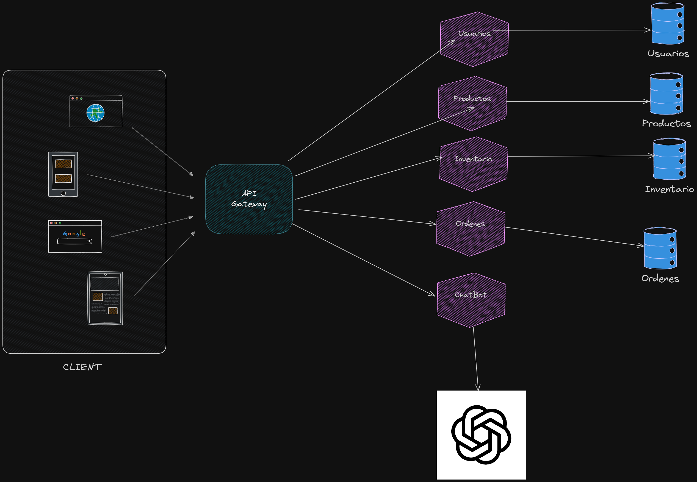

# Práctica 9 - Chatbot con IA 

**Angel Sique – 202012039**

## Descripción del Proyecto

Esta práctica consiste en el desarrollo de un chatbot inteligente que actúa como asistente virtual para una tienda en línea. El chatbot responde preguntas frecuentes de los usuarios y permite realizar acciones como:

- Consultar productos disponibles
- Generar órdenes de compra
- Consultar inventario
- Atender preguntas generales mediante inteligencia artificial

El sistema backend está implementado con Flask, utiliza LangChain y OpenAI para generación de respuestas, y se comunica con microservicios previamente creados. El frontend está desarrollado en React.

## Estructura del Proyecto

# P9

* [doc/](.\P9\doc)
  * [arquitectura.png](.\P9\doc\arquitectura.png)
  * [README.md](.\P9\doc\README.md)
* [Frontend/](.\P9\Frontend)
  * [practica-9/](.\P9\Frontend\practica-9)
    * [node_modules/](.\P9\Frontend\practica-9\node_modules)
    * [public/](.\P9\Frontend\practica-9\public)
    * [src/](.\P9\Frontend\practica-9\src)
    * [.gitignore](.\P9\Frontend\practica-9\.gitignore)
    * [package-lock.json](.\P9\Frontend\practica-9\package-lock.json)
    * [package.json](.\P9\Frontend\practica-9\package.json)
    * [README.md](.\P9\Frontend\practica-9\README.md)
* [kubernetes/](.\P9\kubernetes)
  * [cronjob/](.\P9\kubernetes\cronjob)
    * [cronjob.yaml](.\P9\kubernetes\cronjob\cronjob.yaml)
    * [Dockerfile](.\P9\kubernetes\cronjob\Dockerfile)
    * [script.py](.\P9\kubernetes\cronjob\script.py)
  * [deployments/](.\P9\kubernetes\deployments)
    * [chatbot-deployment.yaml](.\P9\kubernetes\deployments\chatbot-deployment.yaml)
    * [grafana-deployment.yaml](.\P9\kubernetes\deployments\grafana-deployment.yaml)
    * [inventory-deployment.yaml](.\P9\kubernetes\deployments\inventory-deployment.yaml)
    * [orders-deployment.yaml](.\P9\kubernetes\deployments\orders-deployment.yaml)
    * [products-deployment.yaml](.\P9\kubernetes\deployments\products-deployment.yaml)
    * [prometheus-deployment.yaml](.\P9\kubernetes\deployments\prometheus-deployment.yaml)
    * [users-deployment.yaml](.\P9\kubernetes\deployments\users-deployment.yaml)
  * [hpa/](.\P9\kubernetes\hpa)
    * [inventory-hpa.yaml](.\P9\kubernetes\hpa\inventory-hpa.yaml)
    * [orders-hpa.yaml](.\P9\kubernetes\hpa\orders-hpa.yaml)
    * [products-hpa.yaml](.\P9\kubernetes\hpa\products-hpa.yaml)
    * [users-hpa.yaml](.\P9\kubernetes\hpa\users-hpa.yaml)
  * [ingress/](.\P9\kubernetes\ingress)
    * [ingress.yaml](.\P9\kubernetes\ingress\ingress.yaml)
  * [logging/](.\P9\kubernetes\logging)
    * [crds.yaml](.\P9\kubernetes\logging\crds.yaml)
    * [elastic-sysctl-daemonset.yaml](.\P9\kubernetes\logging\elastic-sysctl-daemonset.yaml)
    * [es-cluster.yaml](.\P9\kubernetes\logging\es-cluster.yaml)
    * [fluentbit-configmap.yaml](.\P9\kubernetes\logging\fluentbit-configmap.yaml)
    * [fluentbit-daemonset.yaml](.\P9\kubernetes\logging\fluentbit-daemonset.yaml)
    * [kibana.yaml](.\P9\kubernetes\logging\kibana.yaml)
    * [namespace.yaml](.\P9\kubernetes\logging\namespace.yaml)
    * [operator.yaml](.\P9\kubernetes\logging\operator.yaml)
    * [prometheus-configmap.yaml](.\P9\kubernetes\logging\prometheus-configmap.yaml)
  * [monitoring/](.\P9\kubernetes\monitoring)
    * [inventory-servicemonitor.yaml](.\P9\kubernetes\monitoring\inventory-servicemonitor.yaml)
    * [orders-servicemonitor.yaml](.\P9\kubernetes\monitoring\orders-servicemonitor.yaml)
    * [products-servicemonitor.yaml](.\P9\kubernetes\monitoring\products-servicemonitor.yaml)
    * [users-servicemonitor.yaml](.\P9\kubernetes\monitoring\users-servicemonitor.yaml)
  * [secrets/](.\P9\kubernetes\secrets)
    * [openai-secret.yaml](.\P9\kubernetes\secrets\openai-secret.yaml)
  * [services/](.\P9\kubernetes\services)
    * [chatbot-service.yaml](.\P9\kubernetes\services\chatbot-service.yaml)
    * [grafana-service.yaml](.\P9\kubernetes\services\grafana-service.yaml)
    * [ingress.yaml](.\P9\kubernetes\services\ingress.yaml)
    * [inventory-service.yaml](.\P9\kubernetes\services\inventory-service.yaml)
    * [orders-service.yaml](.\P9\kubernetes\services\orders-service.yaml)
    * [products-service.yaml](.\P9\kubernetes\services\products-service.yaml)
    * [prometheus-service.yaml](.\P9\kubernetes\services\prometheus-service.yaml)
    * [users-service.yaml](.\P9\kubernetes\services\users-service.yaml)
  * [namespace.yaml](.\P9\kubernetes\namespace.yaml)
* [Services/](.\P9\Services)
  * [api-gateway/](.\P9\Services\api-gateway)
    * [src/](.\P9\Services\api-gateway\src)
    * [Dockerfile](.\P9\Services\api-gateway\Dockerfile)
    * [package.json](.\P9\Services\api-gateway\package.json)
  * [chatbot-service/](.\P9\Services\chatbot-service)
    * [.env](.\P9\Services\chatbot-service\.env)
    * [.gitignore](.\P9\Services\chatbot-service\.gitignore)
    * [Dockerfile](.\P9\Services\chatbot-service\Dockerfile)
    * [main.py](.\P9\Services\chatbot-service\main.py)
    * [requirements.txt](.\P9\Services\chatbot-service\requirements.txt)
  * [img/](.\P9\Services\img)
    * [crear-index-panel.png](.\P9\Services\img\crear-index-panel.png)
    * [dashboard-cluster.png](.\P9\Services\img\dashboard-cluster.png)
    * [dashboard-microservicios.png](.\P9\Services\img\dashboard-microservicios.png)
    * [edit-rule.png](.\P9\Services\img\edit-rule.png)
    * [kibana-dicover.png](.\P9\Services\img\kibana-dicover.png)
    * [servicios-en-prometheus.png](.\P9\Services\img\servicios-en-prometheus.png)
    * [sleccionar-index.png](.\P9\Services\img\sleccionar-index.png)
  * [inventory-service/](.\P9\Services\inventory-service)
    * [src/](.\P9\Services\inventory-service\src)
    * [Dockerfile](.\P9\Services\inventory-service\Dockerfile)
    * [inventory.db](.\P9\Services\inventory-service\inventory.db)
    * [package.json](.\P9\Services\inventory-service\package.json)
  * [orders-service/](.\P9\Services\orders-service)
    * [app/](.\P9\Services\orders-service\app)
    * [database.db](.\P9\Services\orders-service\database.db)
    * [Dockerfile](.\P9\Services\orders-service\Dockerfile)
    * [main.py](.\P9\Services\orders-service\main.py)
    * [requirements.txt](.\P9\Services\orders-service\requirements.txt)
  * [products-service/](.\P9\Services\products-service)
    * [src/](.\P9\Services\products-service\src)
    * [.dockerignore](.\P9\Services\products-service\.dockerignore)
    * [Dockerfile](.\P9\Services\products-service\Dockerfile)
    * [package.json](.\P9\Services\products-service\package.json)
    * [products.db](.\P9\Services\products-service\products.db)
  * [users-service/](.\P9\Services\users-service)
    * [app/](.\P9\Services\users-service\app)
    * [Dockerfile](.\P9\Services\users-service\Dockerfile)
    * [main.py](.\P9\Services\users-service\main.py)
    * [requirements.txt](.\P9\Services\users-service\requirements.txt)
  * [docker-compose.yml](.\P9\Services\docker-compose.yml)
  * [README.md.md](.\P9\Services\README.md.md)


## Tecnologías Utilizadas

- Python 3.12
- Flask
- LangChain con OpenAI
- React
- Axios
- Docker
- Kubernetes

## Funcionalidades del Chatbot

| Acción           | Ejemplo de entrada                   | Comportamiento esperado                    |
|------------------|--------------------------------------|--------------------------------------------|
| Consultar productos | ¿Qué productos tienen disponibles? | Realiza un query GraphQL al microservicio de productos |
| Inventario        | ¿Qué hay en el inventario?          | Consulta el microservicio de inventario     |
| Preguntas generales | ¿Cómo puedo devolver un producto?  | La respuesta se genera mediante OpenAI      |

## Funcionamiento del Chatbot

El chatbot está diseñado para interactuar con los usuarios de manera natural y brindarles asistencia dentro de la tienda en línea. Su funcionamiento combina respuestas automáticas predefinidas con inteligencia artificial, permitiendo ofrecer una experiencia más cercana y útil.

Cuando el usuario escribe una pregunta o una solicitud (por ejemplo: *“Quiero comprar 2 camisas”*), el chatbot analiza el mensaje y toma una decisión según el tipo de consulta. Si se trata de una acción concreta, como comprar un producto o ver el inventario, el chatbot se conecta con los servicios internos del sistema para obtener la información en tiempo real o ejecutar la acción solicitada.

Por ejemplo:

* Si el usuario desea ver los productos disponibles, el chatbot consulta directamente la base de datos de productos.
* Si el usuario quiere realizar una compra, el chatbot registra la orden con los datos proporcionados.
* Si el usuario pregunta por el inventario, el chatbot devuelve la cantidad actual de productos disponibles.

Cuando la pregunta no está relacionada con una acción específica (como *“¿Qué métodos de pago aceptan?”* o *“¿Cómo puedo devolver un producto?”*), el chatbot utiliza un modelo de inteligencia artificial para generar una respuesta clara basada en políticas y procedimientos definidos previamente.

En resumen, el chatbot combina reglas simples con respuestas inteligentes para brindar una atención efectiva, rápida y adaptada a las necesidades de los usuarios.

Perfecto. Aquí tienes una sección completa que puedes agregar a tu documentación bajo el título **“Descripción de la Herramienta, Manual de Uso y Arquitectura”**, con todos los elementos que solicitaste:

---

## Descripción de la Herramienta Utilizada

Para el desarrollo del chatbot se utilizó **OpenAI**, una plataforma de inteligencia artificial que ofrece acceso a modelos avanzados de lenguaje como GPT-3.5 y GPT-4, por medio de una API. Esta herramienta permite generar respuestas automáticas y naturales a partir de preguntas formuladas por los usuarios.

### Funcionalidades clave de OpenAI (usadas en este proyecto):

* Generación de texto coherente y contextualizado.
* Comprensión del lenguaje natural.
* Adaptación de respuestas según el tipo de consulta.
* Configuración de respuestas iniciales mediante instrucciones (system prompts).

### Plan de precios utilizado:

Se utilizó el paquete más económico ofrecido por OpenAI, con un costo de **5 dólares**. Este plan incluye aproximadamente **200,000 tokens** para el modelo GPT-3.5-turbo, lo que equivale a unas **12,000 a 15,000 solicitudes tipo chatbot**, dependiendo de la longitud de cada pregunta y respuesta.

> Un "token" representa una parte de una palabra. Por ejemplo, “Hola, ¿cómo estás?” equivale aproximadamente a 6 tokens.

### Restricciones del servicio:

* Se requiere una clave API válida para utilizar la plataforma.
* Existe un límite diario de solicitudes dependiendo del plan contratado.
* La API requiere conexión a Internet, por lo que no puede utilizarse localmente sin acceso en línea.

---

## Manual de Uso del Chatbot

### Acceso:

* Desde navegador: `http://localhost:3000`
* Desde API Gateway: `http://localhost:5010/chatbot`

* Acceso publicado: `http://chatbot-p9-202012039.s3-website.us-east-2.amazonaws.com/`

### ¿Cómo interactuar?

El chatbot permite escribir preguntas o solicitudes como si se hablara con una persona. A continuación se muestran ejemplos de entrada válidos:

#### Ejemplos de inputs válidos:

| Entrada del usuario                 | Función que activa                |
| ----------------------------------- | --------------------------------- |
| `¿Qué productos hay disponibles?`   | Consulta de productos (catálogo)  |
| `¿Qué hay en el inventario?`        | Consulta de inventario            |
| `¿Cómo puedo devolver un producto?` | Generación de respuesta con IA    |
| `¿Aceptan tarjetas de débito?`      | Respuesta informativa mediante IA |

El sistema responde de inmediato con la información solicitada o una respuesta automática generada por inteligencia artificial.

---

## Diagrama de Arquitectura del Chatbot

A continuación se muestra el diagrama del chatbot:



**Descripción del flujo:**

1. El usuario accede desde el frontend (React).
2. Las preguntas se envían al API Gateway.
3. El Gateway reenvía las preguntas al microservicio `chatbot-service`.
4. El chatbot decide si debe consultar productos (GraphQL), registrar una compra, consultar inventario, o responder usando OpenAI.
5. La respuesta se devuelve al usuario por el mismo canal.

## Docker

**Backend:**

```bash
docker build -t chatbot-service .
docker run -p 5010:5010 chatbot-service
```

**Frontend:**

```bash
npm install
npm start
```

## Despliegue en Kubernetes

Archivos relevantes para el despliegue:

* `kubernetes/deployments/chatbot-deployment.yaml`
* `kubernetes/services/chatbot-service.yaml`
* `kubernetes/secrets/openai-secret.yaml`

Comandos:

```bash
kubectl apply -f kubernetes/secrets/openai-secret.yaml
kubectl apply -f kubernetes/deployments/chatbot-deployment.yaml
kubectl apply -f kubernetes/services/chatbot-service.yaml
```
